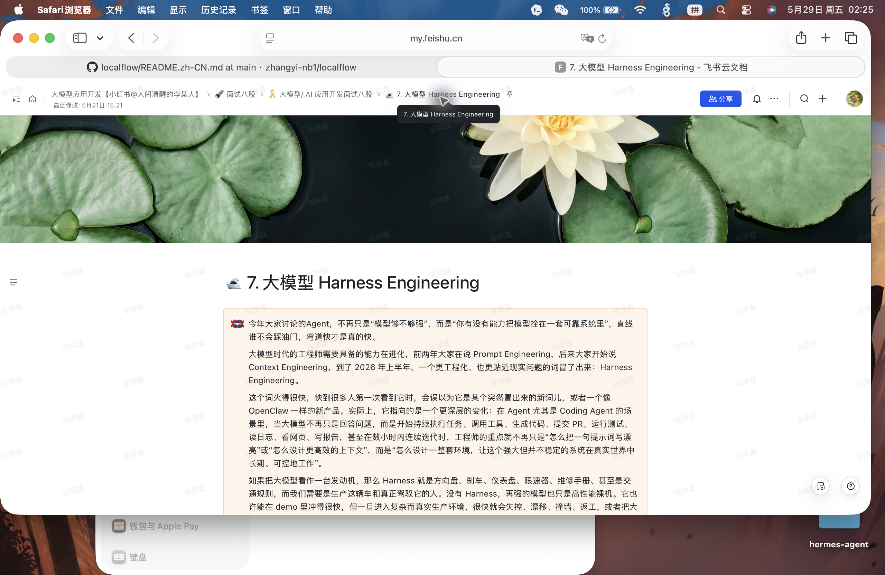
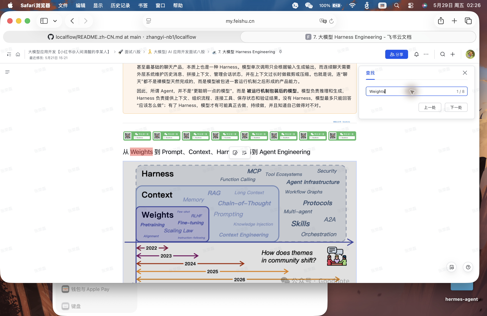
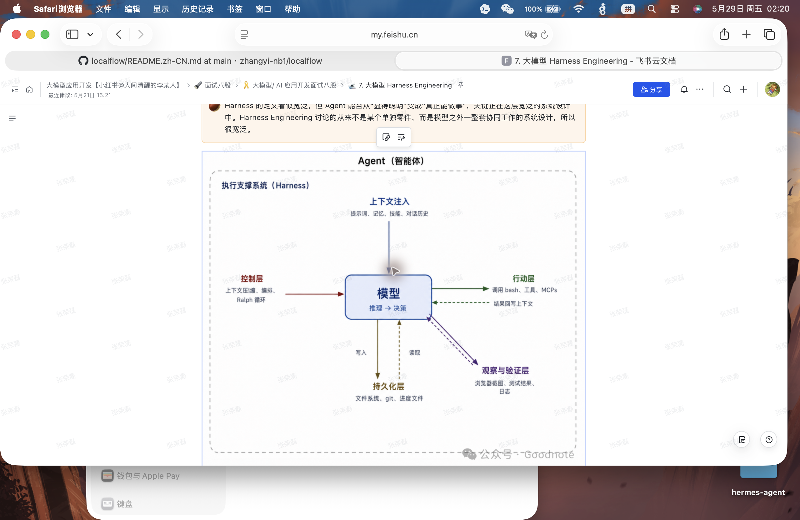
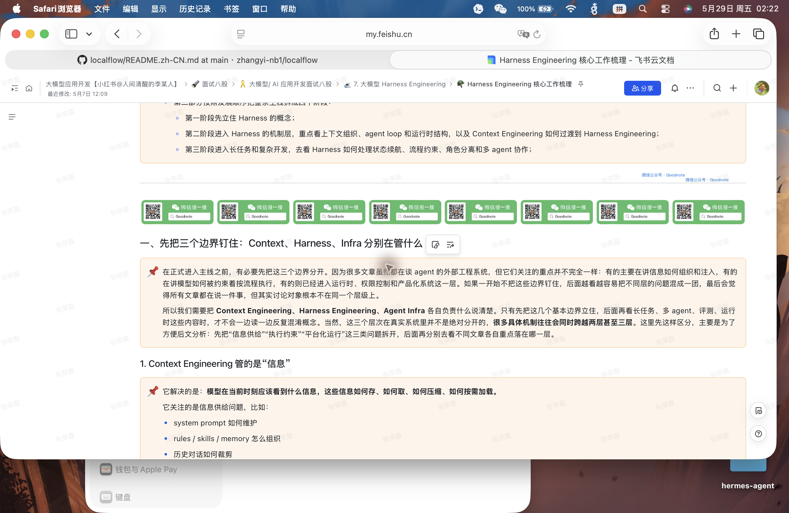
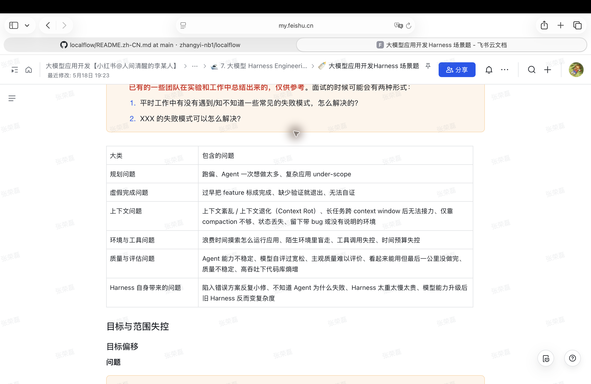
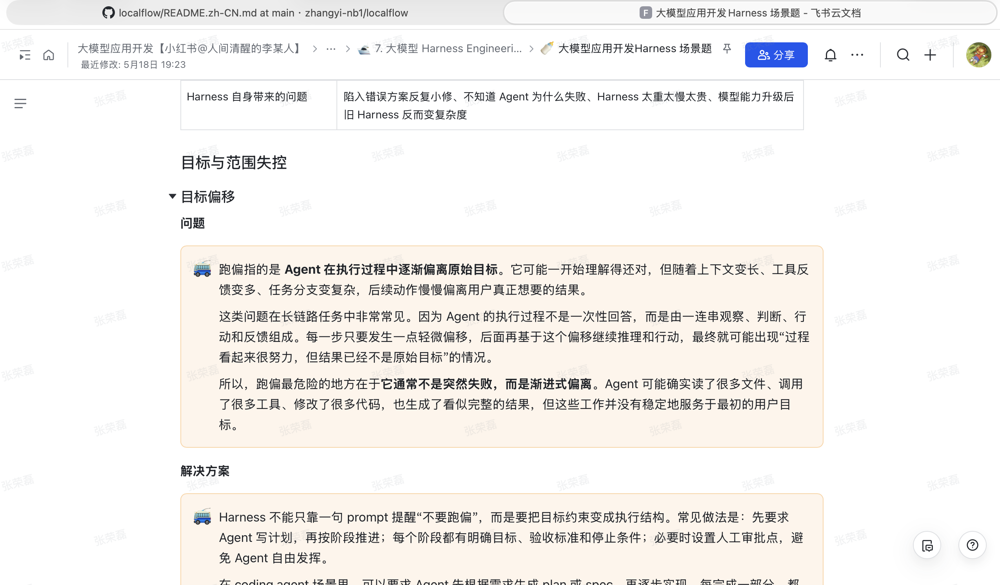

# Feishu Harness Engineering Summary

来源：飞书知识库「7. 大模型 Harness Engineering」及其两个子页面：

- 「Harness Engineering 核心工作梳理」
- 「大模型应用开发 Harness 场景题」

采集方式：通过本地 Safari 已登录页面读取可见正文与目录结构。本文是面向 LocalFlow 的高保真结构化研究笔记，不是原文逐字搬运。

截图说明：截图只用于关键片段引用说明，不做连续整页归档。已补入的截图位于 `docs/research/feishu_harness_screenshots/`。

## 1. 一句话结论

Harness Engineering 讨论的不是「模型够不够聪明」，而是「如何把强模型放进一套可靠、可控、可恢复、可验证、可持续执行的工程系统里」。

当大模型只是聊天或补全时，工程重点可以放在 prompt、上下文和输出格式上；但当 Agent 开始读文件、改代码、调用工具、运行测试、提交 PR、看日志、响应反馈、连续迭代时，决定它是否真有生产力的，往往不是模型本体，而是模型外面的执行系统。

这正是 Harness 的位置：它把模型从「会回答」推向「能做事」，再从「能做事」推向「能持续、稳定、可控地做事」。

## 2. Harness 的隐喻

页面用了两个隐喻来解释 Harness。

第一种是车辆隐喻：如果把模型看成发动机，Harness 就是方向盘、刹车、仪表盘、限速器、维修手册和交通规则。发动机决定动力，但车辆能不能在真实道路上可靠行驶，还需要控制、反馈、维护和约束系统。

第二种是驾驭隐喻：Harness 本义包含挽具、马具、安全带，也可作动词表示利用、驾驭、控制力量。模型像潜力巨大但方向不稳定的力量，Harness 不是替它奔跑，也不是改变它的「基因」，而是把它约束、引导和组织起来，让它在任务目标下稳定发挥。

因此，Harness 不是单纯限制模型，而是驾驭模型。它既要防止失控，也要把模型能力转化为可持续交付的工程能力。

关键截图：



- 建议截取片段：主页面开头对「模型像发动机，Harness 像方向盘/刹车/仪表盘」的解释。
- 用途：放在本文第 2 节，作为 Harness 隐喻的原文证据。

## 3. Harness 的定义

页面引用了一个关键视角：

> Agent = Model + Harness

这个公式的重点不是口号，而是视角切换：Agent 的能力不只来自模型参数，也来自模型外层的工程机制。

可拆成两部分：

| 部分 | 负责什么 | 说明 |
| --- | --- | --- |
| `Model` | 智能 | 推理、生成、规划、决策 |
| `Harness` | 把智能组织成生产力 | 上下文注入、控制机制、行动能力、状态持久化、观察与验证 |

更准确地说，Harness 是所有不属于模型本体、但参与 Agent 执行的代码、配置和运行逻辑。它包括但不限于：

- prompt 和系统规则的组织方式
- context 注入、摘要、压缩、检索
- tool / shell / API / MCP 调用
- 任务 plan、阶段、循环和停止条件
- 状态持久化、handoff、checkpoint
- 权限控制、审批点、预算限制
- trace、日志、测试、verifier、eval
- repair、rollback、retry、resume

没有 Harness，模型只是潜力；有了 Harness，模型才可能成为真正可用的 Agent。

## 4. 为什么现在强调 Harness

页面把 Harness 的必要性归结为两件事。

第一，`Agent-first` 工作流改变了软件开发分工。过去是 human-first：人类工程师理解需求、设计方案、写代码、跑测试、修 bug，AI 更多是解释、补全或生成片段。Agent-first 之后，人类开始把更完整的任务交给 Agent，让它规划、修改、执行、验证，并根据反馈继续迭代。

第二，模型本身不是完整的任务执行系统。模型仍然是输入输出系统：接收上下文，生成文本。即使推理能力很强，它也不天然具备持续状态管理、工具调用、代码执行、环境访问、实时知识获取、错误恢复和结果验证能力。

真实 Agent 任务恰恰依赖这些能力：

- 记住任务进度
- 读写文件
- 运行测试
- 调用 API
- 根据执行结果调整计划
- 判断任务是否真的完成
- 在失败后恢复、重试、回滚或接力

这说明所谓 Agent 并不是「更聪明一点的模型」，而是被运行机制包装后的模型。模型负责推理和生成，Harness 负责提供上下文、组织流程、连接工具、保存状态、验证结果。

关键截图：



## 5. 工程师角色变化

页面提出一个很关键的转变：工程师正在从 `implementation owner` 转向 `capability owner`。

过去，工程师主要为某段代码、某个模块、某个实现负责。现在，如果团队认真把编码、调试、测试、文档、排障交给 Agent，工程师要负责的是「Agent 能不能稳定完成某类任务」。

这会改变失败后的第一反应。Agent 失败时，工程师不应只是自己下场修代码，而要问：

1. Agent 缺的到底是什么能力？
2. 怎么把这个能力做成 Agent 看得懂、可执行、可约束、可验证的系统能力？

这就是 Harness 的工程化入口。个人经验需要沉淀进系统：

- 规则写进项目说明、AGENTS.md 或 policy
- 排障路径变成脚本、trace 面板、runbook
- 高频 review 意见变成 checklist、lint、test 或 evaluator
- 验收标准进入测试、CI、verifier
- 高风险操作进入 approval / dry-run / preview / rollback 流程

## 6. 从 Weights 到 Agent Engineering 的层次

页面把大模型工程能力的演化串成一条外扩链路：

| 层次 | 关注点 | 典型问题 |
| --- | --- | --- |
| `Weights` | 模型基础能力 | 模型是否具备推理、生成、工具理解等基础能力 |
| `Prompt Engineering` | 指令激发 | 如何用提示词激发模型已有能力 |
| `Context Engineering` | 信息环境 | 当前任务中模型应该看到什么、如何组织上下文 |
| `Harness Engineering` | 执行系统 | 工具、状态、反馈、验证、控制如何组成执行回路 |
| `Agent Engineering` | 业务和平台系统 | Agent 如何在真实业务、组织、产品和平台中运行 |

这个区分对 LocalFlow 很重要：如果只做 prompt、skill、pack 或上下文拼装，LocalFlow 仍然像一个模板化工具箱。要成为 harness，必须把执行控制、状态、验证、恢复、权限、trace、rollback 当成内核能力。

待补截图：`02_concept_ladder.png`

- 建议截取片段：页面中「Weights / Prompt / Context / Harness / Agent Engineering」层级图或文字串联。
- 用途：放在第 6 节，说明 Harness 位于 context 外层、Agent engineering 内层。

## 7. Harness 的五层结构

页面把 Harness 理解为围绕模型的外层执行回路。模型在中心，负责 reasoning 和 deciding；Harness 在外围，负责接入真实任务环境。

可概括为五层：

| 层 | 职责 | 它解决什么 |
| --- | --- | --- |
| `Context Injection` | 信息注入层 | 让模型知道现在该看什么，包括提示词、规则、记忆、技能、对话历史、检索材料 |
| `Control` | 执行控制层 | 让模型按流程推进，包括 plan、阶段、循环、审批、停止条件、漂移预算 |
| `Action` | 行动执行层 | 让模型能操作外部世界，包括 bash、工具、MCP、API、文件、代码执行 |
| `Persist` | 状态持久化层 | 保存进度、环境状态、关键决策、上下文摘要、执行记录，支持长任务续航和接力 |
| `Observe & Verify` | 观察与验证层 | 读取结果、日志、测试、截图、评估输出，并判断任务是否真的完成 |

这五层共同把模型接入一个可执行、可观察、可纠偏的闭环：

1. `Context` 告诉模型当前状态和目标。
2. `Control` 限定执行路线和边界。
3. `Action` 让模型采取实际行动。
4. `Persist` 让任务不会因上下文窗口或会话中断而丢失。
5. `Observe & Verify` 让系统知道结果是否满足目标，并把反馈送回下一轮。

关键截图：



- 建议截取片段：主页面「Harness 的核心结构」图。
- 用途：放在第 7 节，作为五层结构的可视化证据。

## 8. Harness 设计原则

页面强调：Harness 不是越复杂越好。

好的 Harness 首先要结构清楚，其次才是能力完整。堆更多工具、更多规则、更多 skill，并不必然提升任务成功率，反而可能让 Agent 被流程拖慢、被规则干扰，或者让工程师更难判断失败原因。

可以提炼出四条设计原则：

| 原则 | 说明 | 对 LocalFlow 的含义 |
| --- | --- | --- |
| 先确定结构 | 明确信息、控制、行动、状态、验证分别由谁负责 | 不要把所有逻辑塞进 recipe 或 skill |
| 做减法 | Harness 复杂度必须服务于任务成功率 | 不为 corner case 增加窄模板 |
| 针对模型定制 | 不同模型能力边界不同，Harness 要随之调整 | 强模型可减少过度约束，弱模型需要更多 guardrail |
| 观察、修改、验证、再简化 | 从失败 trace 和 eval 结果中迭代 | 以 trace/eval/rollback 证据驱动 roadmap |

## 9. Harness 的未来与争议

页面提到两种立场。

反对者认为 Harness 更像拐杖。随着模型能力增强，很多外部机制会被模型内化，旧 Harness 可能变成复杂度负担。这个观点提醒我们：Harness 不能固化成越来越厚的外壳，必须随着模型能力变化而简化。

支持者认为模型只是引擎，Harness 是控制系统。真实任务中的权限、工具、环境、流程、验证、协作、审计、恢复，不可能完全靠模型权重解决。即使模型更强，外部工程系统仍然需要存在，只是形态会变化。

综合判断：Harness 的具体形式会变，但不会消失。一部分机制会被模型内化，另一部分会进入 runtime、workflow、eval、governance、product infra。关键问题不是「Harness 会不会存在」，而是「它会以什么形式存在、如何随模型能力边界演化」。

## 10. 子页面一：核心工作梳理

「Harness Engineering 核心工作梳理」页面的价值，是把容易混淆的概念边界先拆开，然后按阅读和实践路线推进。

### 10.1 三个边界

| 层次 | 管什么 | 典型问题 |
| --- | --- | --- |
| `Context Engineering` | 信息 | 模型当前应该看到什么；信息如何存、取、压缩、淘汰；rules / skills / memory 如何组织；历史对话如何裁剪；检索结果如何注入 |
| `Harness Engineering` | 执行 | 模型拿到信息后是否按要求执行；是否按流程推进；出错后是否纠偏；长任务和多轮任务是否能持续；多 agent 是否能协作 |
| `Agent Infra` | 平台化与产品化 | 上下文机制和执行机制如何变成可复用、可扩展、可权限控制、可产品化的运行底座 |

最关键的区分是：

- Context Engineering 的重点不是流程，而是信息编排。
- Harness Engineering 的重点不是给什么信息，而是如何让模型按给的信息执行。
- Agent Infra 的重点不是单次任务，而是把机制产品化、平台化、权限化、可复用化。

更实用的判断法是：

| 如果问题是 | 更接近哪一层 | 说明 |
| --- | --- | --- |
| 模型看不到、看错、忘了或混用了信息 | `Context Engineering` | 要修的是信息供给、检索、压缩、裁剪、优先级和上下文分层 |
| 模型看到了信息，但不按流程做、做完不能自证、错了不能恢复 | `Harness Engineering` | 要修的是执行结构、状态机、验证、审批、repair、rollback 和 trace |
| 这些机制如何跨 CLI / IDE / Desktop / Web 复用，并接入权限、后台任务、多项目、多用户 | `Agent Infra` | 要修的是 runtime、平台能力、权限模型、部署形态和产品化入口 |

这对 LocalFlow 很关键：`AGENTS.md`、rules、skills、memory 本身首先是 context；只有当它们和可执行的控制点、verifier、trace、approval、rollback 连接起来时，才进入 Harness Engineering；当这些能力被抽象成跨入口、跨项目、可权限控制的底座时，才进入 Agent Infra。

关键截图：



- 建议截取片段：子页面中 Context / Harness / Infra 三层边界说明。
- 用途：放在第 10 节，作为概念边界证据。

### 10.2 阅读主线

页面把 Harness 学习路线拆成几个阶段：

| 阶段 | 目标 | 代表材料 |
| --- | --- | --- |
| 第一阶段：概念立住 | 搞清为什么强调 Harness、Harness 是什么、应该用什么框架理解它 | OpenAI Harness engineering、LangChain Anatomy of an Agent Harness、Fowler Harness engineering |
| 第二阶段：补机制和上下文层 | 看 context organization、agent loop、runtime structure，以及 Context 到 Harness 的过渡 | Fowler Context Engineering、OpenAI Codex agent loop、OpenAI App Server |
| 第三阶段：长任务和复杂开发 | 看状态续航、流程约束、角色分离、多 agent 协作 | Anthropic long-running agents、application development harness、LangChain deep agents |
| Anthropic 补充 | 更偏长任务、有效上下文、长期 agent 执行设计 | Effective context engineering for AI agents 等 |

这个路线的潜台词是：Harness 不是单个工具，而是一套逐层展开的工程问题。先有概念框架，再有执行机制，再有长任务/复杂开发，再有平台化和评估。

### 10.3 核心工作不是写 prompt，而是修执行系统

这个子页面对「Harness 核心工作」的真正指向很明确：工程师的工作不是继续把 prompt 写长，而是把 Agent 反复犯错的地方沉淀成系统机制。

可以拆成两类：

| 类型 | 形式 | 价值 | 风险 |
| --- | --- | --- | --- |
| 软 Harness | `AGENTS.md`、规则、流程清单、提示词、handoff 模板、review checklist | 便宜、灵活、容易调整，适合作为 feedforward 约束 | 依赖模型自觉执行，容易被长上下文稀释 |
| 硬 Harness | 工具、脚本、verifier、状态机、权限、trace、budget、checkpoint、rollback | 能把关键约束变成可执行、可审计、可恢复的机制 | 成本更高，过度设计会拖慢 Agent |

所以核心工作可以表述为：

1. 找到 Agent 在真实任务中反复失败的位置。
2. 判断失败属于 context、control、action、state、verify、infra 中哪一层。
3. 先用最小机制修复，能用软 Harness 解决的不要急着进 kernel。
4. 如果失败会反复出现、影响任务成功率或安全边界，再沉淀为硬 Harness。
5. 每次沉淀后用 trace / verifier / eval 证明它真的减少失败，而不是只增加流程。

这和 LocalFlow 的方向一致：不要把每个 corner case 都包成一个 skill，而要把通用动作原语、observation、repair feedback、drift budget、verifier 和 rollback 做强。

### 10.4 按材料拆出的核心贡献

子页面列出的材料可以按「它补的是 Harness 哪一块」来读，而不是按文章标题顺序读。

| 材料 | 核心贡献 | 对 Harness 的含义 |
| --- | --- | --- |
| OpenAI `Harness engineering: leveraging Codex in an agent-first world` | 当 Agent 成为主要执行者，工程师职责从手写代码转为设计环境、表达意图、构建反馈回路 | Harness 是 Agent-first 开发的工程系统，不是 prompt 技巧 |
| LangChain `The Anatomy of an Agent Harness` | 把 Agent 理解成模型加 Harness：模型负责推理和决策，Harness 提供上下文、工具、状态、观察 | Agent 能力来自模型和外部执行环境的组合 |
| Fowler `Harness engineering for coding agent users` | coding agent 用户需要 feedforward 和 feedback harness，避免只靠一次性指令 | 好的 harness 同时约束输入和校正输出 |
| Fowler `Context Engineering for Coding Agents` | Context 是主动的信息管理，不是把材料塞进长 prompt | Context 是 Harness 的上游，但不能替代执行控制 |
| OpenAI `Unrolling the Codex agent loop` | 把 agent loop 展开成可观察的 observe / decide / act / observe 循环 | 每一步都应成为 traceable event，而不是黑箱自动执行 |
| OpenAI `Unlocking the Codex harness: how we built the App Server` | Harness 还包括让 Agent 能访问、操作、观察产品环境的 runtime | 浏览器、应用服务、日志、UI 状态都属于执行环境 |
| Anthropic `Effective harnesses for long-running agents` | 长任务需要状态、checkpoint、验证、中断恢复和有边界的 autonomy | 长任务不能只靠更长上下文，要靠外部化状态和恢复机制 |
| Anthropic `Harness design for long-running application development` | 复杂应用开发需要环境、测试、反馈、角色边界和协作机制 | 应用开发 Harness 要覆盖从实现到验证再到交接的完整生命周期 |
| LangChain `Improving Deep Agents with harness engineering` | deep agents 的改进路径不只是换模型，还包括工具、状态、反思、长期任务结构 | Deep agent 的稳定性主要来自 Harness 设计 |

其中 OpenAI 材料强调「Agent-first 后工程系统要重建」，LangChain 强调「Agent = Model + Harness」，Fowler 强调「feedforward / feedback」，Anthropic 强调「长任务续航」。这四条合在一起，基本就是 LocalFlow 后续要坚持的主线：保留 plan / dry-run / approval / verify / rollback，同时把 execute 阶段升级成有观察、有边界、有修复能力的 step-by-step loop。

## 11. 子页面二：Harness 场景题

「大模型应用开发 Harness 场景题」页面把 Harness 落到真实失败模式。

它先指出：传统 LLM 应用失败，多是回答不准确、格式不稳定、幻觉、漏掉上下文；Agent 失败更复杂，因为 Agent 不只是生成文本，而是在真实环境里连续执行动作。一旦涉及读文件、改代码、调用工具、运行命令、生成 PR、响应反馈，错误就会从单点错误扩散成流程错误、状态错误、工具错误、验证错误和工程质量错误。

### 11.0 场景题的回答框架

这个页面的重点不是罗列 bug，而是训练一种 Harness 视角：看到 Agent 失败时，先判断失败发生在执行链路的哪一层，再给出机制化解法。

一个合格回答应包含五步：

1. 先归类：这是规划、完成判定、上下文、工具环境、质量评估，还是 Harness 自身的问题。
2. 解释根因：为什么单纯加一句 prompt 不能稳定解决。
3. 给 Harness 机制：用 plan gate、approval、checkpoint、verifier、budget、trace、rollback、repair 等机制落地。
4. 给验证证据：用测试、日志、截图、diff、trace、eval、人工 review 证明真的改善。
5. 给恢复路径：失败后如何回滚、重试、缩小范围、重新规划或交接。

页面把失败模式分成六大类。

### 11.1 规划问题

包括：

- 目标偏移
- Agent 一次想做太多
- 复杂应用 under-scope

`目标偏移` 指 Agent 在执行中逐渐偏离原始目标。它通常不是突然失败，而是渐进式偏离：每一步只偏一点，后续又基于偏移继续推理，最后结果看似完整，却没有稳定服务于最初目标。

Harness 解法：

- 先生成 plan / spec
- 按阶段推进
- 每阶段设置目标、验收标准、停止条件
- 对架构变更、删除文件、引入依赖、扩大范围等高风险节点设置人工审批点
- 每一阶段回看原始目标，而不是只看当前代码是否合理

`Agent 一次想做太多` 的本质是范围过大导致执行不可控。解法是拆小任务、限制每轮动作数量、用 milestone 或 vertical slice 递进。

`复杂应用 under-scope` 则相反，Agent 低估了真实复杂度，只做表面路径。解法是要求它先识别依赖、状态、异常路径、边界条件和验证方式，再进入实现。

补充整理：

| 典型信号 | Harness 机制 | LocalFlow 对应能力 |
| --- | --- | --- |
| Agent 开始处理原任务之外的文件、依赖、架构改动 | 原始目标锚点、阶段目标、漂移预算、scope expansion approval | Phase 26 drift budget / failsafes |
| 一轮里试图完成太多模块，导致不可验证 | milestone、vertical slice、最大动作数、阶段验收 | plan / dry-run / approval |
| 复杂应用只做 happy path，没有异常和状态设计 | 先要求 dependency map、风险列表、验收标准，再允许实现 | verifier / eval / review checklist |

### 11.2 虚假完成问题

包括：

- 过早把 feature 标成完成
- 缺少验证就退出
- 无法自证

这类问题的共同点是：Agent 给出完成结论，但没有足够证据说明真的完成。看起来产出了代码或报告，但没有测试、日志、截图、运行记录或验收证明。

Harness 解法：

- 完成前必须经过 `completion gate`
- 强制提供验证证据：测试结果、lint、截图、日志、diff、运行命令输出
- 引入独立 verifier，而不是只相信模型自评
- 让「完成」成为状态机中的受控状态，而不是模型一句话

对 LocalFlow 来说，这对应 verifier、trace、dry-run、rollback、repair 的价值。

补充整理：

| 典型信号 | Harness 机制 | LocalFlow 对应能力 |
| --- | --- | --- |
| Agent 说完成，但没有命令输出、测试结果或截图 | completion gate，完成前必须提交 evidence bundle | verifier output / trace |
| 代码改了但没有跑验证，或验证失败仍然收尾 | 独立 verifier 决定任务状态，而不是模型自评 | semantic verifier / eval suite |
| 最终回复和原始需求无法一一对应 | acceptance checklist，按需求项逐条映射证据 | final evidence summary |

### 11.3 上下文问题

包括：

- 上下文紊乱 / Context Rot
- 长任务跨 context window 后无法接力
- 仅靠 compaction 不够
- 状态丢失
- 留下带 bug 或没有说明的环境

这类问题的本质是：长任务中，模型能看到的信息会退化、混乱、过期或缺失。单纯压缩对话不够，因为任务状态、环境状态、关键决策、失败原因、剩余工作如果没有外部化，就会在接力时丢失。

Harness 解法：

- 状态外部化：任务 ledger、checkpoint、action history、decision log
- handoff summary：明确已完成、未完成、阻塞、验证状态
- 环境说明：如何运行、当前进程、端口、临时文件、已知问题
- 上下文分层：长期规则、任务目标、最近观察、当前计划分开管理
- 关键决策持久化，而不是埋在聊天历史里

这部分和 LocalFlow 的 trace.jsonl、ActionEvent、observation、repair feedback 高度相关。

补充整理：

| 典型信号 | Harness 机制 | LocalFlow 对应能力 |
| --- | --- | --- |
| Agent 反复忘记已经做过的决定 | decision log、checkpoint、action history | `trace.jsonl` / ActionEvent |
| context window 之后无法接力 | handoff summary，记录完成项、阻塞项、验证状态、剩余风险 | long-task handoff |
| 只做 compaction，丢失环境状态 | 把运行方式、进程、端口、临时文件、已知 bug 外部化 | workspace/runtime state |
| 新一轮基于过期假设继续执行 | observation refresh，关键步骤前重新读取当前文件和运行状态 | observation / repair feedback |

### 11.4 环境与工具问题

包括：

- 浪费时间摸索怎么运行应用
- 陌生环境里盲走
- 工具调用失控
- 时间预算失控

Agent 在真实仓库里经常不知道如何启动、测试、构建、访问浏览器、连接服务。如果 Harness 没有提供清晰入口，它会靠猜测行动，浪费 token 和时间，甚至做出危险操作。

Harness 解法：

- 标准化运行入口：README、dev script、Makefile、任务说明
- 工具白名单和权限模型
- timeout、预算、最大步数、最大漂移范围
- dry-run / preview / approval
- 对高风险动作设置确认点
- 把「如何运行」变成机器可执行的环境协议

对 LocalFlow 来说，这对应 permission、budget、workspace abstraction、runtime setup、tool boundary。

补充整理：

| 典型信号 | Harness 机制 | LocalFlow 对应能力 |
| --- | --- | --- |
| Agent 靠猜测启动项目、跑错目录或错端口 | 机器可读的 workspace profile 和 runtime discovery | Workspace 抽象候选 |
| 命令越来越随机，时间不断膨胀 | timeout、step budget、command budget、失败重试上限 | budget / failsafe |
| 工具调用可能破坏文件或外部状态 | risk classification、dry-run、approval、permission boundary | risk / permission / approval |
| Agent 无法判断浏览器或应用状态 | 结构化 observation，日志、截图、DOM、进程状态进入反馈回路 | Browser / UI verifier / observation |

### 11.5 质量与评估问题

包括：

- Agent 能力不稳定
- 模型自评过宽松
- 主观质量难以评价
- 看起来能用，但最后一公里没做完
- 质量不稳定
- 高吞吐下代码库熵增

这类问题说明，Agent 可以快速产生大量改动，但如果没有质量门槛，代码库会熵增。模型自评往往偏宽松，尤其在 UI、复杂业务逻辑、边界条件、长期维护性上更明显。

Harness 解法：

- 自动测试、lint、typecheck、CI
- eval suite 和任务特定 verifier
- review checklist
- 质量阈值和退出条件
- 限制变更范围
- 要求可复现证据
- 对主观质量引入人工 review 或视觉验证

这部分直接映射到 LocalFlow 的 eval、semantic verifier、UI verifier、rollback 路径。

补充整理：

| 典型信号 | Harness 机制 | LocalFlow 对应能力 |
| --- | --- | --- |
| 编译或测试通过，但体验明显不完整 | 任务特定 verifier、视觉检查、人工 review gate | UI verifier / screenshot evidence |
| Agent 高频产出大量 diff，代码库质量下降 | 变更范围限制、review checklist、architecture fitness checks | scoped action / trace review |
| 模型自评过宽松 | 独立 eval，不用模型一句话判定质量 | eval suite / verifier |
| 最后一公里没做完 | acceptance criteria 明确到可观察结果 | completion gate |

### 11.6 Harness 自身带来的问题

包括：

- 陷入错误方案反复小修
- 不知道 Agent 为什么失败
- Harness 太重、太慢、太贵
- 模型能力升级后，旧 Harness 反而变成复杂度

这是页面里很重要的反身性提醒：Harness 自己也会失败。它可能过度约束模型，导致执行缓慢；也可能机制太多，导致失败原因不透明；还可能在模型升级后继续保留旧 guardrail，反而成为负担。

Harness 解法：

- trace 诊断失败发生在 plan、execute、verify、repair 哪一层
- rollback / repair 路径要真实可用
- 依据失败证据调整机制，不凭直觉加规则
- 周期性删除无效规则、无效 skill、无效 guardrail
- 对模型升级后的能力边界重新评估

这和 LocalFlow 的 §10.7 ledger 精神一致：内核边界变更要诚实记账，不能把复杂度偷偷塞进系统。

补充整理：

| 典型信号 | Harness 机制 | LocalFlow 对应能力 |
| --- | --- | --- |
| repair loop 一直在同一错误方案上小修 | 失败分类、重规划触发条件、rollback 到上一个 checkpoint | repair / rollback |
| 失败原因看不清，是模型、工具、上下文还是 verifier 的问题 | trace 分层：plan / execute / observe / verify / repair | ActionEvent / observation |
| 规则太多，Agent 被拖慢或互相冲突 | 周期性规则审计，删除无证据价值的 guardrail | §10.7 ledger / phase review |
| 模型升级后旧约束仍然保留 | 用 eval 重新测能力边界，再简化 Harness | eval-driven simplification |

### 11.7 场景题到 LocalFlow 的映射

| 场景题失败模式 | LocalFlow 当前/下一阶段应该强化的能力 | 证据来源 |
| --- | --- | --- |
| 目标偏移 | plan gate、approval、drift budget、阶段验收、scope expansion 记录 | `trace.jsonl` + Phase 26 drift events |
| 虚假完成 | completion gate、独立 verifier、evidence bundle、final answer 对齐原需求 | verifier output + eval result |
| Context Rot / 状态丢失 | action history、decision log、checkpoint、handoff summary | ActionEvent + observation |
| 工具和环境失控 | workspace profile、permission、timeout、budget、dry-run preview | risk log + command trace |
| 质量不稳定 / 代码熵增 | eval suite、semantic verifier、UI verifier、review checklist、rollback | eval pass/fail + screenshot evidence |
| Harness 太重或失效 | §10.7 ledger、phase review、trace-based pruning、模型升级后重新评估 | architecture ledger + benchmark |

这一节对 LocalFlow 的最大提醒是：Harness 不是为了让 Agent 看起来更自动，而是为了把失败变成可定位、可修复、可复盘的工程事件。只要某个机制不能改善安全、可控、可恢复、可验证、任务成功率或 trace-based 持续改进，就不该进入 roadmap。

关键截图：



- 建议截取片段：场景题页面中的六大失败模式表格。
- 用途：放在第 11 节，作为失败模式分类证据。

关键截图：



- 建议截取片段：场景题页面「目标偏移」的问题与解决方案。
- 用途：说明为什么 prompt 提醒不够，必须把目标约束做成执行结构。

## 12. 对 LocalFlow 的直接启发

这三页内容对 LocalFlow 的方向有很强的校准作用。

### 12.1 LocalFlow 的定位应继续 Harness-first

LocalFlow 不能被讲成「桌面整理 agent」或「一组 workflow recipe」。这会把项目拉回应用层。更准确的定位是：

LocalFlow 是本地 Agent Execution Harness，把模型推理转化为受控、可观察、可验证、可恢复的任务执行。

这正好对应用户在 AGENTS.md 里写的三个不满：

| 不满 | 飞书内容给出的校准 |
| --- | --- |
| 定位不清 | Harness 的价值在执行系统，不在单个模板或 skill |
| 灵感不够 | 成熟讨论都围绕 context、control、action、persist、observe/verify 展开 |
| 经验不足 | 不要锁死蓝图，按失败模式、trace、eval 逐步调整 |

### 12.2 Phase 26 react loop 必须是受控执行回路

阶段内 react loop 的价值不应是「让 Agent 更自由」，而是把每一步纳入可观察、可验证、可恢复的执行回路。

这意味着 Phase 26 设计要持续回答：

- 这一步观察到了什么？
- 为什么选择这个 action？
- 是否仍在已批准 plan 范围内？
- 漂移是否超过 budget？
- 结果如何进入 observation？
- verifier 如何判断任务是否推进？
- 失败时如何 repair 或 rollback？

否则 react loop 只是更长的自动执行，不是更好的 harness。

### 12.3 不要继续堆窄 skill

飞书内容反复指向一个结论：Agent 失败不是因为缺一个模板，而是执行结构不足。

所以后续建议应优先补强：

- 通用动作原语
- 状态持久化
- trace / observation
- verifier / eval
- approval / permission
- drift budget
- rollback / repair
- 长任务 handoff

只有当某个 skill 是为了演示或沉淀 harness 能力时，才值得加入。

## 13. 可落到项目文档的候选更新

可以考虑后续把 `docs/PROJECT_DIRECTION.md` 的 Tracking Goal 补成更直接的表达：

```diff
- Tracking Goal: build a local automation assistant for desktop workflows.
+ Tracking Goal: build a local Agent Execution Harness that turns model reasoning into controlled, observable, verifiable, recoverable task execution.
```

也可以把 `Current Roadmap Bias` 写得更硬一点：

```diff
- Prefer practical workflow support and useful recipes.
+ Prefer harness kernel capabilities over narrow recipes: control, trace, verifier, repair, rollback, permission, budget, and long-task state.
```

这两个 diff 只是建议，不应在未确认的情况下直接改动主方向文档。

## 14. 后续可补的截图清单

截图只用于关键片段引用说明，不建议保存连续整页截图。当前已补入 6 张关键截图；其中 Weights 到 Agent Engineering 层级图未截到完整清晰版本，保留为后续可补项。

| 文件名 | 状态 | 对应章节 | 应截内容 | 作用 |
| --- | --- | --- | --- | --- |
| `01_harness_metaphor.png` | 已补 | 第 2 节 | 发动机/方向盘/刹车隐喻 | 说明 Harness 是控制系统 |
| `02_agent_first_vs_harness.png` | 已补 | 第 4 节 | Agent-first 与 Harness 对比表 | 说明开发范式和工程机制的关系 |
| `02_concept_ladder.png` | 待补 | 第 6 节 | Weights 到 Agent Engineering 层次 | 说明 Harness 的概念位置 |
| `03_core_structure.png` | 已补 | 第 7 节 | Harness 核心结构图 | 说明五层结构 |
| `04_context_harness_infra.png` | 已补 | 第 10 节 | Context / Harness / Infra 边界 | 说明三层边界 |
| `05_failure_taxonomy.png` | 已补 | 第 11 节 | 六大失败模式表格 | 说明场景题分类 |
| `06_goal_drift_solution.png` | 已补 | 第 11.1 节 | 目标偏移的问题与解法 | 说明结构化约束比 prompt 更重要 |
